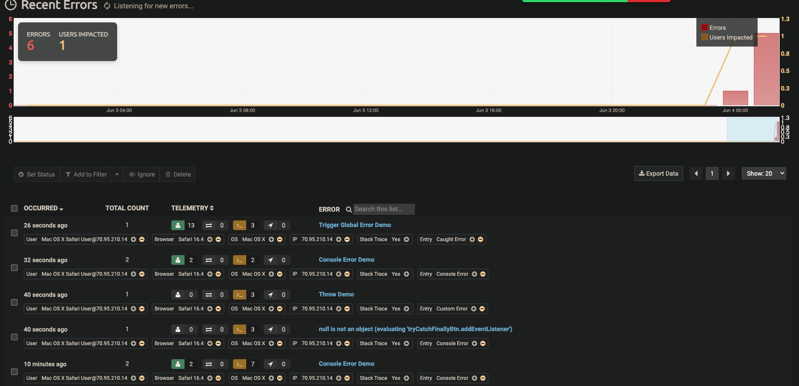

# Lab 9 - Starter

## Author
- Name: Anh Pham

## Description
In this lab, I learned how to use **JavaScript error handling**, **monitoring**, and **JS Docs** to improve the quality and reliability of my web applications. JavaScript error handling is a process of detecting and handling errors that occur in the client-side code. Monitoring is a way of tracking and reporting errors that happen in the browser. JS Docs is a tool that generates documentation from comments in the code. 😎

## What I Learned
JavaScript error handling involves using various methods and constructs, such as `console`, `try/catch/finally`, `throw`, and custom errors. Monitoring can be done using third-party services, such as TrackJS, that provide a dashboard for error analysis. JS Docs helps to document the code structure, parameters, types, and returns of functions and classes.

## Screenshots
